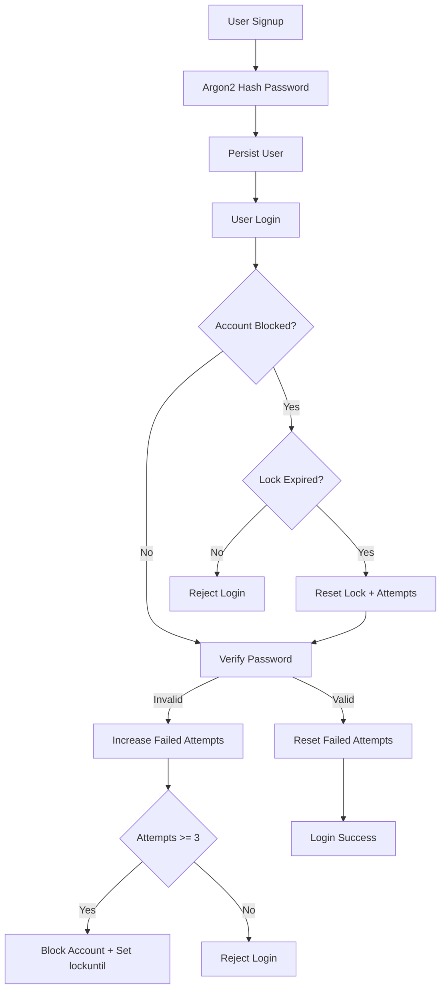

<div align="center">
  

  

  <p>
    
    
    
    
  </p>

  <p>
    
    
    
  </p>
</div>

## Overview
ShieldWrite is a secure full-stack blogging platform built with a strong focus on authentication, authorization, and practical backend security.

This repository currently contains a working backend with:
- Signup/Login flow
- Argon2 password hashing
- Failed login tracking
- Temporary account lock and automatic unlock logic
- Role field support for RBAC expansion

## Why ShieldWrite
Modern web apps need more than basic login. ShieldWrite is designed as a learning-to-production bridge for implementing secure identity patterns and scalable backend architecture.

## Core Features

### Authentication (Implemented)
- User signup with validation
- User login with credential verification
- Password hashing and verification using Argon2

### Security Controls (Implemented)
- Failed login attempt counter
- Account auto-block after repeated failures
- Time-based lock expiry and unlock
- Brute-force resistance baseline

### RBAC Foundations (Implemented)
- User roles in schema: user, admin
- Role exposed in login response for downstream authorization

### Blog Domain Models (Implemented)
- Blog model with author relation
- Draft/published status field
- Likes, shares, and comments counters

### Comment Domain Models (Implemented)
- Comment model with user-blog relations

### Planned Enhancements
- JWT authentication and protected routes
- MFA (OTP/TOTP)
- Email verification
- Redis for caching and OTP/session workloads
- Nginx rate limiting and edge hardening
- Full React frontend

## Tech Stack

### Backend
- Node.js
- Express.js
- MongoDB
- Mongoose
- Argon2

### Tooling
- Nodemon
- Dotenv
- CORS
- Postman

## Project Structure
```text
ShieldWrite/
|-- backend/
|   |-- server.js
|   |-- package.json
|   `-- src/
|       |-- config/
|       |   `-- db.js
|       |-- controllers/
|       |   `-- auth.Controller.js
|       |-- middleware/
|       |-- models/
|       |   |-- user.model.js
|       |   |-- blog.model.js
|       |   `-- comment.model.js
|       `-- routes/
|           `-- auth.Routes.js
|-- frontend/
`-- ngnix/
```

## Security Workflow


## API Endpoints

### Auth Routes (Current)
- POST /api/signup : Register user
- POST /api/login : Login with lock-protection checks

### Planned Routes
- Blog CRUD routes
- Comment create/fetch routes
- Admin moderation routes

## Database Design

### User
- firstName
- lastName
- age
- email (unique)
- password (hashed)
- role (user/admin)
- isVerified
- failedLoginAttempts
- accountBlocked
- lockuntil
- createdAt, updatedAt

### Blog
- title
- content
- author (User reference)
- likes
- shares
- comments
- status (draft/published)
- createdAt, updatedAt

### Comment
- text
- user (User reference)
- blog (Blog reference)
- createdAt, updatedAt

## Getting Started

### 1. Clone Repository
```bash
git clone https://github.com/<your-username>/ShieldWrite.git
cd ShieldWrite/backend
```

### 2. Install Dependencies
```bash
npm install
```

### 3. Configure Environment
Create a `.env` file inside `backend/`:
```env
PORT=5000
MONGO_URI=your_mongodb_connection_string
```

### 4. Run in Development
```bash
npm run dev
```

### 5. Run in Production Mode
```bash
npm start
```

## Testing Checklist (Postman)
- Signup with valid payload
- Login with correct credentials
- Login with wrong password (multiple times)
- Confirm account lock after threshold
- Confirm unlock after lock duration

## Roadmap
- Add JWT issuance and auth middleware
- Add refresh token strategy
- Add MFA challenge flow (OTP/TOTP)
- Add email verification and resend flow
- Add Redis-backed OTP and throttling support
- Add Nginx rate limits and edge protections
- Complete React frontend integration
- Add Docker-based deployment

## Author
Suman Yadav,charan,mohan

## Note
ShieldWrite is a security-first learning project that mirrors real-world authentication design and backend hardening patterns.

<div align="center">
  
</div>
